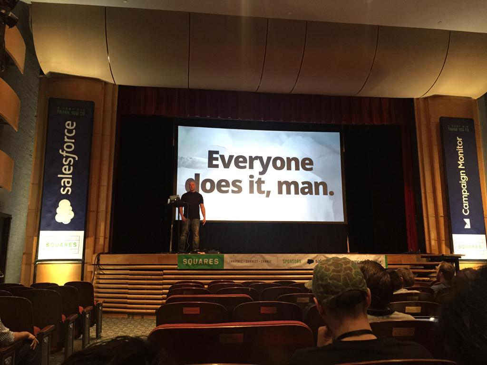

# The Power of Making Mistakes

**Abstract:** Nobody likes to make mistakes. From a young age we are taught that mistakes are something to be avoided. But what if success is contingent upon making mistakes? What if mistakes are an inevitable part of doing something new? They are. And we should make them more. What we need are ways to mitigate the cost of making mistakes, so we can make mistakes more freely, and more abundantly.

Given at [Squares Conference](http://squaresconference.com) in Grapevine, Texas, on March 27th, 2015.

- [Talk slides on SpeakerDeck](https://speakerdeck.com/jglovier/the-power-of-making-mistakes)

[Get in touch](mailto:jglovier@github.com) if you'd like me to give this talk at your conference.

[&larr; Back to talks index](https://github.com/jglovier/speaking/)

